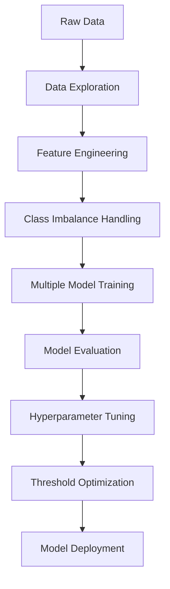

# 🎯 Customer Churn Prediction - Machine Learning Pipeline

[](https://python.org)
[](https://streamlit.io)
[](https://scikit-learn.org)
[](LICENSE)

A comprehensive machine learning pipeline to predict customer churn in the telecommunications industry. This project demonstrates end-to-end ML development from data exploration to production deployment, achieving **75.7% recall** and **0.835 AUC-ROC** through advanced model optimization.

## 🎯 Business Problem

**Challenge**: High customer churn rates in telecommunications industry  
**Impact**: Lost revenue, increased acquisition costs, reduced customer lifetime value  
**Solution**: Build a predictive model to identify at-risk customers  
**Business Value**: Enable targeted retention campaigns and reduce churn by 20-30%

## 🏆 Key Results

| Metric | Score | Business Impact |
|--------|-------|-----------------|
| **Recall** | 75.7% | Identifies 3 out of 4 customers who will churn |
| **AUC-ROC** | 0.835 | Excellent discrimination ability |
| **F1-Score** | 62.6% | Balanced precision-recall performance |
| **Accuracy** | 76.0% | Overall prediction accuracy |

## 📊 Dataset Overview

- **Source**: Telco Customer Churn Dataset
- **Size**: 7,032 customers with 50+ engineered features
- **Target**: Binary classification (Churn: Yes/No)
- **Challenge**: Class imbalance (73% No Churn, 27% Churn)

### Key Features
- **Demographics**: Senior Citizen, Gender, Partner, Dependents
- **Services**: Phone Service, Internet Service, Online Security, Tech Support
- **Billing**: Contract Type, Payment Method, Monthly/Total Charges
- **Behavioral**: Tenure, Service Usage Patterns

## 🔄 Technical Pipeline



### 🛠️ Technical Stack

| Component | Technology |
|-----------|------------|
| **Data Processing** | Pandas, NumPy |
| **Machine Learning** | Scikit-learn, XGBoost, LightGBM |
| **Class Imbalance** | SMOTE, SMOTEENN |
| **Visualization** | Matplotlib, Seaborn, Plotly |
| **Web Framework** | Streamlit |
| **Model Persistence** | Joblib, Pickle |

## 🚀 Quick Start

### Prerequisites
- Python 3.8+
- pip package manager

### Installation

1. **Clone the repository**
   ```bash
   git clone https://github.com/yourusername/churn-prediction.git
   cd churn-prediction
   ```

2. **Install dependencies**
   ```bash
   pip install -r requirements.txt
   ```

3. **Run the dashboard**
   ```bash
   streamlit run churn_dashboard.py
   ```
   
   Or use the deployment script:
   ```bash
   python deploy.py
   ```

4. **Access the dashboard**
   - Open your browser to `http://localhost:8501`
   - Navigate through the tabs to explore the project


## 🎨 Dashboard Features

### 🏠 Overview Tab
- Dataset statistics and key metrics
- Interactive visualizations of churn patterns
- Feature analysis and correlations

### 🔍 Predict Churn Tab
- Interactive customer input form
- Real-time churn probability calculation
- Risk assessment with actionable recommendations

### 📊 Insights Tab
- Model performance metrics
- Feature importance analysis
- Advanced analytics and trends

## 🔬 Model Development Process

### 1. **Exploratory Data Analysis**
- Data quality assessment
- Feature distribution analysis
- Target variable exploration
- Correlation analysis

### 2. **Feature Engineering**
- Tenure grouping for customer lifecycle stages
- One-hot encoding for categorical variables
- Domain-specific feature creation

### 3. **Class Imbalance Handling**
- **SMOTE**: Synthetic Minority Oversampling Technique
- **SMOTEENN**: Combined oversampling and undersampling
- Balanced training set for fair model evaluation

### 4. **Model Selection**
Tested 9 different algorithms:
- **Traditional**: Logistic Regression, Decision Tree, Random Forest
- **Ensemble**: Gradient Boosting, XGBoost, LightGBM
- **Other**: KNN, Naive Bayes, SVM

### 5. **Hyperparameter Optimization**
- Grid Search Cross-Validation
- 5-fold CV for robust parameter selection
- AUC-ROC scoring for imbalanced data

### 6. **Threshold Optimization**
- Precision-Recall curve analysis
- F1-Score maximization
- Business-aligned decision threshold (0.347)

## 📈 Model Performance Comparison

| Model | AUC-ROC | Accuracy | Recall | F1-Score |
|-------|---------|----------|--------|----------|
| **Gradient Boosting (Tuned)** | **0.835** | **0.790** | **0.757** | **0.626** |
| XGBoost | 0.832 | 0.786 | 0.559 | 0.581 |
| LightGBM | 0.828 | 0.779 | 0.553 | 0.571 |
| Logistic Regression | 0.818 | 0.775 | 0.551 | 0.565 |
| Random Forest | 0.806 | 0.760 | 0.503 | 0.527 |

## 🔍 Key Insights

### High Risk Factors
- **Contract Type**: Month-to-month contracts (highest churn risk)
- **Payment Method**: Electronic check users
- **Service Level**: No tech support or online security
- **Tenure**: New customers (0-12 months)
- **Internet**: Fiber optic users

### Low Risk Factors
- **Contract**: Two-year contracts (most stable)
- **Payment**: Automatic payments (bank transfer, credit card)
- **Tenure**: Long-term customers (61+ months)
- **Services**: Full service bundle with tech support

## 💼 Business Applications

### Proactive Retention
- Identify high-risk customers before they churn
- Trigger automated retention campaigns
- Prioritize customer service outreach

### Operational Efficiency
- Focus retention efforts on high-risk segments
- Optimize marketing spend on at-risk customers
- Reduce customer acquisition costs

### Revenue Protection
- Prevent revenue loss from high-value churners
- Improve customer lifetime value
- Enhance customer satisfaction

## 🛠️ Usage Examples

### Making Predictions
```python
import joblib
import pandas as pd

# Load the trained model
model = joblib.load('best_churn_model_gradient_boosting_tuned.pkl')

# Prepare customer data
customer_data = pd.DataFrame({
    'Contract_Month-to-month': [1],
    'PaymentMethod_Electronic check': [1],
    'tenure_group_1 - 12': [1],
    # ... other features
})

# Make prediction
prediction = model.predict(customer_data)
probability = model.predict_proba(customer_data)[:, 1]
```

### Running the Dashboard
```bash
# Start the Streamlit dashboard
streamlit run churn_dashboard.py

# Or use the deployment script
python deploy.py
```

## 🎓 Skills Demonstrated

### Machine Learning
- **Supervised Learning**: Classification algorithms and ensemble methods
- **Feature Engineering**: Domain-specific feature creation
- **Model Selection**: Algorithm comparison and selection
- **Hyperparameter Tuning**: Grid search optimization
- **Threshold Optimization**: Business metric optimization

### Data Science
- **Exploratory Data Analysis**: Comprehensive data exploration
- **Statistical Analysis**: Hypothesis testing and validation
- **Data Preprocessing**: Cleaning and transformation
- **Class Imbalance**: SMOTE and evaluation strategies


### Business Acumen
- **Problem Definition**: Business problem to ML solution
- **Metric Selection**: Business-relevant evaluation metrics
- **Interpretability**: Feature importance and model explanation
- **Deployment**: Production-ready solution
